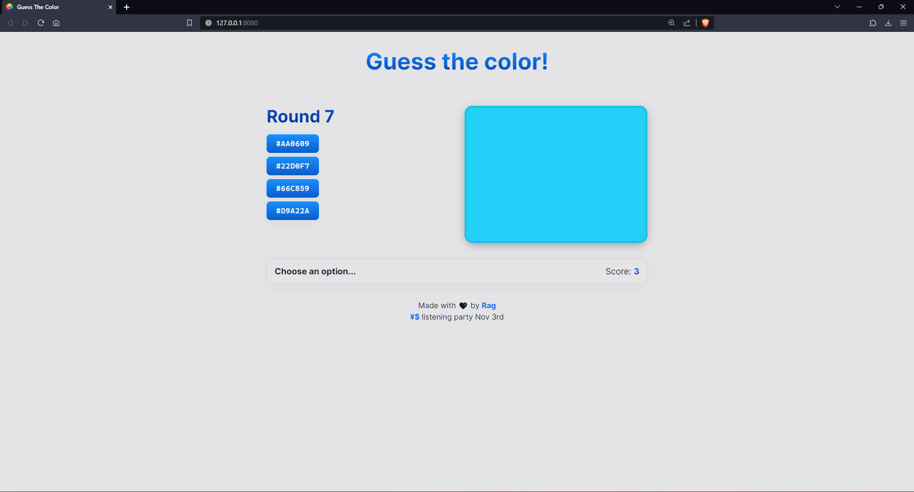

## Table of Contents

-   [Table of Contents](#table-of-contents)
-   [Introduction](#introduction)
-   [Preview](#preview)
-   [Live Site](#live-site)
-   [Flow](#flow)
-   [Diary](#diary)

## Introduction

Simple app which displays a color on the screen, and the player has to guess the color value out of a set of choices.

## Preview

## Live Site

[Guess The Color](https://ragonscreen.github.io/basic-guess-the-color/)

## Flow

1. Display the current round number.
2. Generate a random color.
3. Display the color.
4. Generate and display random choices, out of which, one should be the correct answer.
5. Increase the player's score by one every time they guess the correct answer.
6. Display the new score.
7. Display a message saying either correct or wrong answer.
8. Continue game after a short interval when the player gets the answer either right or wrong.

## Diary

-   19:56 - This seems fairly easy.
-   20:11 - Made a rough sketch of the app on Figma. Also decided to change how the game is supposed to work. There will be a score system instead of persistent guessing on the same round.
-   21:36 - Layout looks about finished, possibly done with the design and CSS.
-   21:56 - Added some colors to the design, including gradients on the text and buttons.
-   23:36 - Kind of forgot to document the rest of the development process. Almost done with the JavaScript now. App is fully functional.
-   00:15 - Tested the app for well over 100 rounds, and added comments in code.
-   00:40 - Finishing touches, and added my favourite link hover effect that I use a lot.
-   18:43 - Fixed a minor bug, where the layout was messed up in smaller screens during the round starting screen.
